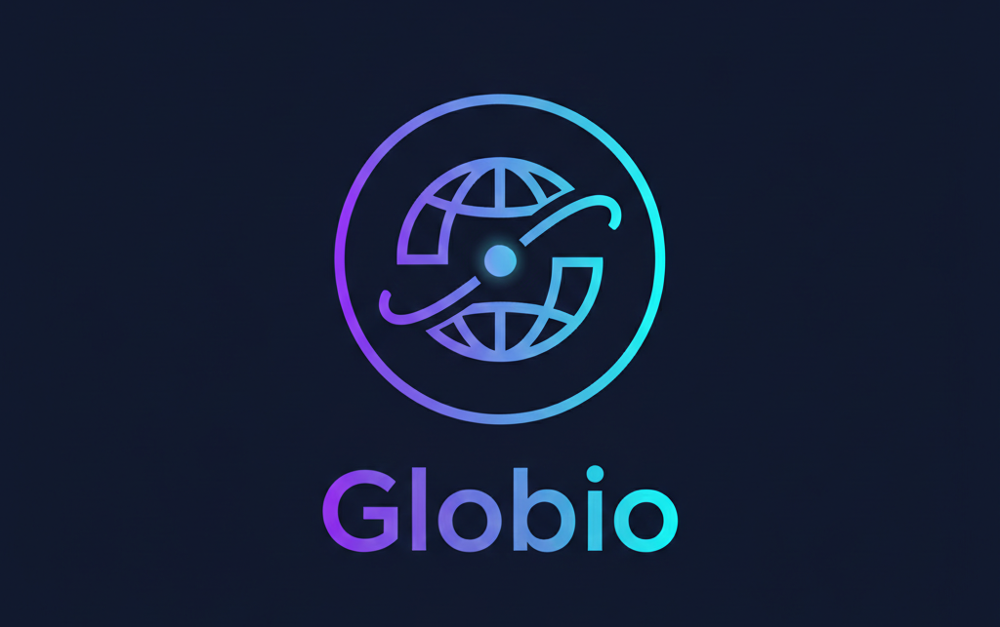

<div align="center">
  
  
  <h1>🎮 Globio: The Serverless Game Backend</h1>
  
  <p><strong>The "Operating System for Games" built on the edge network. Replaces legacy backends like Firebase and PlayFab with lower latency, zero cold starts, and integrated AI.</strong></p>
  
  <p>
    <a href="https://console.globio.stanlink.online"></a>
    <a href="https://docs.globio.stanl.ink"></a>
    <a href="https://discord.gg/globio"></a>
  </p>
  
  <p>
    
    
    
  </p>
</div>

---

## 🎯 What is Globio?

Globio is the complete serverless backend for modern games (Mobile, PC, WebGL). It provides **10 essential services** that replace Firebase, PlayFab, and custom backends with a unified platform built on Cloudflare's global edge network.

### 🏗️ The Core 5 (Essential Services)

| Service | Description | Use Cases |
|---------|-------------|-----------|
| **🗄️ GlobalDoc** | Structured relational database at the edge | Player profiles, inventories, guilds, leaderboards |
| **⚔️ GlobalSync** | Real-time multiplayer with stateful rooms | FPS matches, card games, co-op gameplay |
| **📦 GlobalVault** | Infinite cloud storage for saves and UGC | Save files, screenshots, replays, user content |
| **⚡ GlobalPulse** | Live configuration and feature flags | LiveOps, balancing, A/B testing, events |
| **🆔 Globio ID** | Cross-platform authentication system | Guest login, OAuth, account linking |

### 🚀 The Power 5 (Pro Features)

| Service | Description | Use Cases |
|---------|-------------|-----------|
| **🧠 GlobalBrain** | AI/ML inference at the edge | NPCs, content moderation, procedural generation |
| **📊 GlobalScope** | High-cardinality analytics without cost | Player behavior, retention, custom events |
| **📡 GlobalSignal** | Push notifications and messaging | Engagement, tournaments, social features |
| **⚡ GlobalCode** | Serverless functions with 0ms cold start | Game logic, webhooks, integrations |
| **💎 GlobalMart** | Virtual economy and IAP validation | In-app purchases, virtual currencies, rewards |

---

## ✨ Why Choose Globio?

### 🌍 **Built for Global Scale**
- **Sub-50ms latency** worldwide via Cloudflare's 300+ edge locations
- **Zero cold starts** for functions and database queries
- **Auto-scaling** infrastructure that grows with your game

### 🎮 **Game-First Design**
- **Real-time multiplayer** out of the box
- **AI-powered NPCs** and content moderation
- **Virtual economy** with IAP validation
- **Player analytics** designed specifically for games

### 🔧 **Developer Experience**
- **Firebase-compatible APIs** for easy migration
- **Game engine integrations** (Unity, Unreal, Godot)
- **Comprehensive CLI tools** for deployment
- **Real-time gaming dashboard** for monitoring

### 🛡️ **Enterprise Ready**
- **SOC2 compliance** and security standards
- **99.9% uptime SLA** with global redundancy
- **Dedicated support** for game studios
- **Custom contracts** available

---

## 🚀 Quick Start

### Unity C# Example
```csharp
void Start() {
    // 1. Identity: Login player
    var user = await Globio.ID.LoginAnonymously();
    
    // 2. Config: Check for live events
    if (Globio.Pulse.GetBool("xmas_event")) {
        ShowSantaHat();
    }
    
    // 3. Data: Load player inventory
    var inventory = await Globio.Doc.Get<Inventory>("my_items");
    
    // 4. Multiplayer: Join a match
    await Globio.Sync.JoinRoom("arena_1");
    
    // 5. AI: Talk to NPC
    var reply = await Globio.Brain.Chat("Hello merchant!");
    
    // 6. Analytics: Log game event
    Globio.Scope.Log("game_start", new { level = 1 });
}
```

### JavaScript/Web Example
```javascript
import { Globio } from '@globio/sdk'

// Initialize with your project
const globio = new Globio('your-project-id')

// Authenticate user
const user = await globio.auth.signInAnonymously()

// Store player data
await globio.doc.set('players', user.uid, {
  name: 'Player1',
  level: 1,
  coins: 100
})

// Join multiplayer room
const room = await globio.sync.joinRoom('battle-royale')
room.onMessage('player-move', (data) => {
  updatePlayerPosition(data)
})
```

---

## 🎮 Game Examples

<table>
<tr>
<td width="33%">

### 🏰 RPG Games
- Player progression systems
- Guild management
- Real-time chat
- AI-powered NPCs
- Dynamic events

</td>
<td width="33%">

### ⚔️ Multiplayer Games
- Real-time battles
- Matchmaking systems
- Leaderboards
- Anti-cheat protection
- Tournament management

</td>
<td width="33%">

### 📱 Mobile Games
- Cross-platform saves
- Push notifications
- In-app purchases
- Social features
- Analytics tracking

</td>
</tr>
</table>

---

## 🛠️ SDKs & Integrations

### Game Engines
- **Unity C#** - Native integration with prefabs
- **Unreal Engine** - Blueprint and C++ support
- **Godot** - GDScript and C# bindings
- **Web/HTML5** - JavaScript/TypeScript SDK

### Platforms
- **Mobile** - iOS, Android (React Native, Flutter)
- **Desktop** - Windows, macOS, Linux
- **Console** - PlayStation, Xbox, Nintendo Switch
- **Web** - WebGL, Progressive Web Apps

### Languages
- **JavaScript/TypeScript** - Full-featured SDK
- **C#** - Unity and .NET support
- **Python** - Backend services and tools
- **Go** - High-performance integrations
- **Dart** - Flutter mobile development

---

## 🌟 Success Stories

> *"Globio reduced our backend costs by 95% while improving performance. The real-time multiplayer just works."*  
> **— Sarah Chen, Lead Developer at PixelForge Studios**

> *"Migration from Firebase took 2 hours, not 2 months. The AI features are game-changing."*  
> **— Marcus Rodriguez, CTO at GameCraft Inc**

> *"Our players love the sub-50ms latency. Globio's edge network is incredible."*  
> **— Yuki Tanaka, Indie Developer**

---

## 🔄 Migration from Firebase

Globio provides **drop-in compatibility** with Firebase APIs, making migration seamless:

```javascript
// Before (Firebase)
import { initializeApp } from 'firebase/app'
import { getFirestore } from 'firebase/firestore'

// After (Globio) - Same API!
import { initializeApp } from '@globio/sdk'
import { getFirestore } from '@globio/sdk'
```

**What gets migrated automatically:**
- ✅ Firestore collections → GlobalDoc
- ✅ Firebase Auth users → Globio ID  
- ✅ Firebase Storage → GlobalVault
- ✅ Cloud Functions → GlobalCode
- ✅ Remote Config → GlobalPulse

---

## 🏗️ Architecture

Globio runs on **Cloudflare's global network** with:

- **300+ Edge Locations** for ultra-low latency
- **D1 Database** - SQLite at the edge
- **R2 Storage** - S3-compatible object storage
- **Durable Objects** - Stateful real-time services
- **Workers** - Serverless compute with 0ms cold start
- **KV Store** - Global key-value cache

---

## 📚 Resources

<div align="center">

| Resource | Link | Description |
|----------|------|-------------|
| 🚀 **Console** | [console.globio.stanlink.online](https://console.globio.stanlink.online) | Gaming dashboard and project management |
| 📖 **Documentation** | [docs.globio.stanl.ink](https://docs.globio.stanl.ink) | Complete guides and API reference |
| 💬 **Discord** | [discord.gg/globio](https://discord.gg/globio) | Community support and discussions |
| 🐙 **GitHub** | [github.com/globio](https://github.com/globio) | Open source SDKs and examples |
| 🐦 **Twitter** | [@GlobioPlatform](https://twitter.com/GlobioPlatform) | Updates and announcements |
| 📧 **Support** | support@globio.dev | Technical support and inquiries |

</div>

---

## 🤝 Contributing

We welcome contributions from the gaming community! Here's how to get involved:

1. **🍴 Fork** the repository
2. **🌿 Create** a feature branch: `git checkout -b feature/amazing-feature`
3. **💻 Make** your changes and add tests
4. **📝 Commit** your changes: `git commit -m 'Add amazing feature'`
5. **🚀 Push** to the branch: `git push origin feature/amazing-feature`
6. **🔄 Open** a Pull Request

### Development Areas
- **SDKs** - Game engine integrations
- **Examples** - Sample games and tutorials  
- **Documentation** - Guides and API docs
- **Tools** - CLI utilities and plugins

---

## 📄 License

- **Core Platform**: MIT License
- **Gaming Console**: Proprietary (Free for personal use)
- **SDKs**: MIT License

See [LICENSE](LICENSE) for more details.

---

## 🎉 What's Next?

- [ ] **Unreal Engine SDK** - Blueprint and C++ support
- [ ] **Advanced AI** - Procedural content generation
- [ ] **Blockchain Integration** - NFTs and crypto rewards
- [ ] **VR/AR Support** - Spatial multiplayer experiences
- [ ] **Game Analytics ML** - Predictive player behavior
- [ ] **Live Streaming** - Twitch/YouTube integration
- [ ] **Esports Tools** - Tournament management platform

---

<div align="center">
  <h2>🎮 Ready to Build the Next Hit Game?</h2>
  
  <p>
    <a href="https://console.globio.stanlink.online"></a>
    <a href="https://docs.globio.stanl.ink"></a>
    <a href="https://discord.gg/globio"></a>
  </p>
  
  <p><strong>Built with ❤️ by game developers, for game developers</strong></p>
  
  <p>
    
    
    
  </p>
</div>
